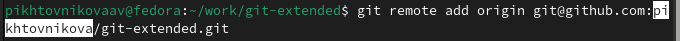

---
## Front matter
title: "Отчет по лабораторной работе №4"
subtitle: "Операционные системы"
author: "Пихтовникова Алёна Владимировна"

## Generic otions
lang: ru-RU
toc-title: "Содержание"

## Bibliography
bibliography: bib/cite.bib
csl: pandoc/csl/gost-r-7-0-5-2008-numeric.csl

## Pdf output format
toc: true # Table of contents
toc-depth: 2
lof: true # List of figures
lot: true # List of tables
fontsize: 12pt
linestretch: 1.5
papersize: a4
documentclass: scrreprt
## I18n polyglossia
polyglossia-lang:
  name: russian
  options:
	- spelling=modern
	- babelshorthands=true
polyglossia-otherlangs:
  name: english
## I18n babel
babel-lang: russian
babel-otherlangs: english
## Fonts
mainfont: PT Serif
romanfont: PT Serif
sansfont: PT Sans
monofont: PT Mono
mainfontoptions: Ligatures=TeX
romanfontoptions: Ligatures=TeX
sansfontoptions: Ligatures=TeX,Scale=MatchLowercase
monofontoptions: Scale=MatchLowercase,Scale=0.9
## Biblatex
biblatex: true
biblio-style: "gost-numeric"
biblatexoptions:
  - parentracker=true
  - backend=biber
  - hyperref=auto
  - language=auto
  - autolang=other*
  - citestyle=gost-numeric
## Pandoc-crossref LaTeX customization
figureTitle: "Рис."
tableTitle: "Таблица"
listingTitle: "Листинг"
lofTitle: "Список иллюстраций"
lotTitle: "Список таблиц"
lolTitle: "Листинги"
## Misc options
indent: true
header-includes:
  - \usepackage{indentfirst}
  - \usepackage{float} # keep figures where there are in the text
  - \floatplacement{figure}{H} # keep figures where there are in the text
---

# Цель работы

Получение навыков правильной работы с репозиториями git.

# Задание

1. Выполнить работу для тестового репозитория.

2. Преобразовать рабочий репозиторий в репозиторий с git-flow и conventional commits.

# Теоретическое введение

Рабочий процесс Gitflow Workflow. Будем описывать его с использованием пакета git-flow. 
### Общая информация
- Gitflow Workflow опубликована и популяризована Винсентом Дриссеном.
- Gitflow Workflow предполагает выстраивание строгой модели ветвления с учётом выпуска проекта.
- Данная модель отлично подходит для организации рабочего процесса на основе релизов.
- Работа по модели Gitflow включает создание отдельной ветки для исправлений ошибок в рабочей среде.
### Последовательность действий при работе по модели Gitflow:
- Из ветки master создаётся ветка develop.
- Из ветки develop создаётся ветка release.
- Из ветки develop создаются ветки feature.
- Когда работа над веткой feature завершена, она сливается с веткой develop.
- Когда работа над веткой релиза release завершена, она сливается в ветки develop и master.
- Если в master обнаружена проблема, из master создаётся ветка hotfix.
- Когда работа над веткой исправления hotfix завершена, она сливается в ветки develop и master.

# Выполнение лабораторной работы

Так как git-flow и Node.js у меня уже установлены и настроены, то перехожу к общепринятым коммитам (рис. @fig:001).

{#fig:001 width=70%}

Данная программа используется для помощи в создании логов. (рис. @fig:002).

{#fig:002 width=70%}

Создаём репозиторий на Гитхаб под названием git-extended (рис. @fig:003).

{#fig:003 width=70%}

Далее делаю первый коммит (рис. @fig:004).

{#fig:004 width=70%}

Добавляю удалённый репозиторий (рис. @fig:005).

{#fig:005 width=70%}

Выкладываем на гх (рис. @fig:006).

{#fig:006 width=70%}

Конфигурация для пакетов Node.js.(рис. @fig:007)

{#fig:007 width=70%}

Сконфигурим формат коммитов. Для этого добавим в файл package.json команду для формирования коммитов(рис. @fig:008).

{#fig:008 width=70%}

Добавим новые файлы, выполним коммит, оправим на github (рис. @fig:009).

{#fig:009 width=70%}

Инициализируем git-flow
Префикс для ярлыков установим в v.
Проверьте, что Вы на ветке develop:
Загрузите весь репозиторий в хранилище:
Установите внешнюю ветку как вышестоящую для этой ветки:
Создадим релиз с версией 1.0.0
Создадим журнал изменений
Добавим журнал изменений в индекс
Зальём релизную ветку в основную ветку
Отправим данные на github
Создадим релиз на github. Для этого будем использовать утилиты работы с github: (рис. @fig:010).

{#fig:010 width=70%}

###Работа с репозиторием git
Разработка новой функциональности
Создадим ветку для новой функциональности
Далее, продолжаем работу c git как обычно.
По окончании разработки новой функциональности следующим шагом следует объединить ветку feature_branch c develop:
Создание релиза git-flow
Создадим релиз с версией 1.2.3:
Обновите номер версии в файле package.json. Установите её в 1.2.3.
Создадим журнал изменений
Добавим журнал изменений в индекс
Зальём релизную ветку в основную ветку
Отправим данные на github
Создадим релиз на github с комментарием из журнала изменений
(рис. @fig:011).

{#fig:011 width=70%}

# Выводы

Я получила навыков правильной работы с репозиториями git.
