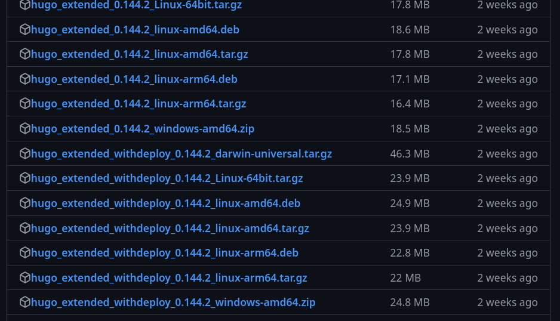
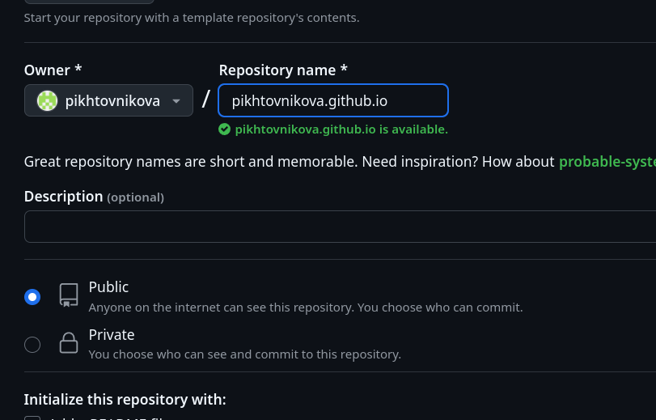
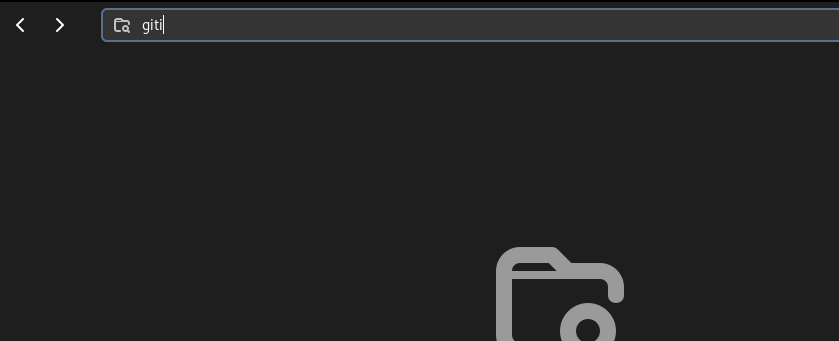
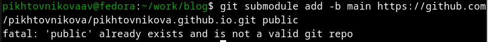
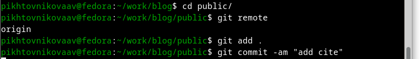

---
## Front matter
lang: ru-RU
title: Первый этап индивидуального проекта
subtitle: Операционные системы
author:
  - Пихтовникова А. В.
institute:
  - Российский университет дружбы народов, Москва, Россия
date: 8 марта 2025

## i18n babel
babel-lang: russian
babel-otherlangs: english

## Formatting pdf
toc: false
toc-title: Содержание
slide_level: 2
aspectratio: 169
section-titles: true
theme: metropolis

## Подключение шрифтов
header-includes:
  - \usepackage{fontspec}
  - \setmainfont{CMU Serif}
  - \setsansfont{CMU Sans Serif}
  - \setmonofont{CMU Typewriter Text}
  - \metroset{progressbar=frametitle,sectionpage=progressbar,numbering=fraction}
---

## Актуальность

Научному работнику полезно иметь сайт-портфолио про него и его проекты.

## Цель

Научиться размещать сайт на Github Pages.  
Выполнить первый этап реализации индивидуального проекта.

## Задачи

1. Установить необходимое ПО  
2. Скачать шаблон темы сайта  
3. Разместить его на хостинге Git  
4. Установить параметры для URL сайта  
5. Разместить заготовку сайта на Github Pages  

## ПО и инструменты

- Hugo  
- GitHub  
- Git  
- GitHub Pages  

## Создание репозитория

Создаю свой репозиторий blog (рис. 2).

## Первый этап проекта

Получаем страницу сайта на локальном сервере (рис. 3).

## Настройка URL сайта

Создаю новый пустой репозиторий, чьё имя будет адресом сайта (рис. 4).

## Отключение public в .gitignore

Перед тем как подключить созданный пустой репозиторий к каталогу public  
из репозитория blog, нужно удалить public из .gitignore (рис. 5).

## Подключение репозитория

Подключаю репозиторий к каталогу public (рис. 6).

## Размещение на Github Pages

Проверяю подключение между public и репозиторием pikhtovnikova.github.io,  
после чего отправляю изменения в глобальный репозиторий (рис. 7).

## Результаты и выводы

- Научилась размещать сайт на Github Pages  
- Разместила шаблон сайта на сервере  

# Спасибо за внимание
